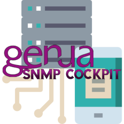
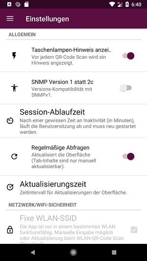
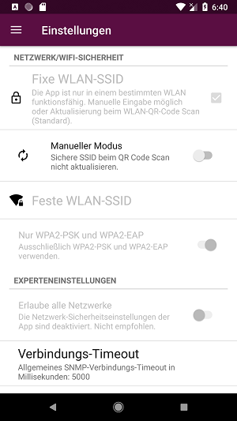
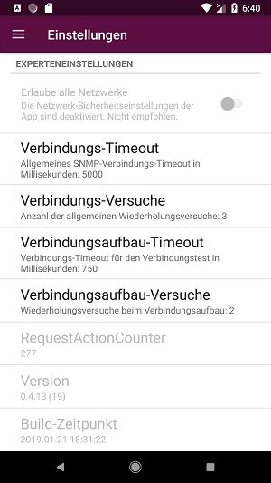

# Genua SNMP Cockpit - V.0.6.0

**Android App zur Bestimmung des Zustands von RZ-Komponenten/Firewalls**

*Gestaltet und entwickelt von Ömer Ergün, Steven Pham, Marius Schuppert*

## Einleitung

Die App *Genua SNMP Cockpit* ist durch die Anforderung des Modules „Software Praktikum 2018/2019“ - Universität Stuttgart,
im Auftrag der genua GmbH (https://www.genua.de/), entstanden.

Die App wurde im Hinblick auf die **Critical Features**, d.h. gemäß Kundenwünschen entwickelt und kann **jede beschriebene Anforderung erfüllen**. Eine detaillierte Auflistung des Funktionsumfangs findet sich weiter unten.

Die App ermöglicht in einer sicheren Netzwerkumgebung SNMP-Verbindungen (Simple Network Management Protocol) herzustellen und Daten anzuzeigen.

## Voraussetzungen

* Android 8.1 API Level 27 (minSdk <=27 und targetSdk >=27) Gerät
* Router mit WLAN-Authentifizierung (WPA2)
* Netzwerkkomponent unterstützt eines der SNMP Versionen (Version 1, Version 2c, Version 3) und ist im Netzwerk verbunden.
* ggf.: WLAN- oder Gerätezugriff als QR-Code für eine schnellere und einfachere Interaktion

## Installation

##### APK-Datei lokal installieren

>Falls die APK noch nicht vorhanden ist, muss dies erst erstellt werden.
>Für die Einrichtung benötigt der Anwender Android Studio und Git auf dem Rechner.

1. Repository klonen: `git clone`
2. Git Submodules holen [Nur im Entwicklungsmodus notwendig]: `git submodule init` und `git submodule update`
3. Android Studio Projekt öffnen
4. Android Studio Projekt synchronisieren und bauen
5. Android Studio Projekt im Emulator ausführen oder APK erstellen lassen

Die auf diese Weise erstellte *.apk*-Datei kann verwendet werden zur Installation des Programms (ggfs. erst nach entsprechend erteilter Installationserlaubnis durch das Android Betriebssystem).

##### APK direkt auf Handy übertragen

>Dazu zunächst über **Einstellungen** &rarr; **Gerätesicherheit** &rarr; **Unbekannte Apps installieren**, zulassen. 
>Je nach Gerät, könnte dies eine andere Menüführung haben. Achte außerdem noch den Punkt **Vorraussetzung**.

1. Die .apk-Datei mittels USB-Kabel/ Bluetooth oder anderem Mittel auf das Handy übertragen.
2. Die APK-Datei wird automatisch vom Gerät erkannt und installiert.
3. App starten

## Funktionen, Features und Verwendung der App

### Critical Features

**Alle Anforderungen des offiziellen [Critical-Feature-Dokumentes](https://sopra.informatik.uni-stuttgart.de/sopra-ws1819/sopra-doku-entwickler/blob/master/Aufgabe/Aufgabe.genua.Rechenzentrum.md) wurden umgesetzt**.

- **SNMP v1, v2c und v3 Verbindungen** in einem WLAN IPv4-Netz mit stets nur **lesenden** Zugriff können in der App hergestellt werden.
- Mithilfe eines [speziellen QR-Code-Formats](./doc/QR_Code_Guide.md) können SNMP-Verbindungen initiiert werden. Entweder unter Angabe der minimalen Informationen, oder durch exaktes Festlegen der Verbindungsparameter im QR-Code.
- Mithilfe eines [WIFI-Standard-QR-Code-Formats](./doc/QR_Code_Guide.md) können WPA2 PSK und WPA2 EAP WLAN-Verbindungen initiiert werden.
- Für eine SNMP v1/v2c Verbindung sind diese Angaben notwendig (auch im QR-Code):
    - IP
    - Community
- Für eine SNMP v3 Verbindung in der App ist notwendig:
    - IP
    - Benutzer
    - Passwort
    - Schlüssel
    - optional: Port
- Für eine SNMP v3 Verbindung mit einem QR-Code ist notwendig:
    - IP
    - Benutzer
    - SecurityLevel und abhängig davon auch
        - Passwort und/oder
        - Schlüssel.
    - optional: AuthProtocol, PrivProtocol, Context
- Jede Geräte-Verbindung hat eine **Geräte-Detailansicht** mit mehreren Tabs. Dort werden dynamisch **26 verschiedene SNMP-Tabellen**, wie unten dargestellt angezeigt. Eigene Abfragen können auch hier durchgeführt werden.
- Die Oberflächen der Hauptansicht sowie die Geräte-Detailansicht werden - *falls aktiviert* - periodisch aktualisiert.
- Die App zeigt die nativ durch DHCP bezogenen Netzwerkinformationen an.
- Beliebig viele **eigene Abfragen** können mit Name, OID, Abfragemodus (einzel oder walk) und Hardware-Tags (auch: "Kategorien") verwaltet werden.
- **Hardware-Tags** (Kategorien) können ebenfalls verwaltet werden.
- Die App hat im Auslieferungszustand für den Kunden Genua GmbH **2 mögliche Netzwerk-Sicherheitslevel**:
    * **Level 1 - Fixe WLAN SSID - Automatischer Modus**:
        - WPA2 PSK oder WPA2 EAP
        - Die beim WIFI-QR-Code Scan gescannte SSID muss immer auf die Verbindung zutreffen.
    * **Level 2 - Fixe WLAN SSID - Manueller Modus**:
        - wie Level 1 nur:
        - Die manuell eingebene SSID muss immer auf die Verbindung zutreffen.

- Falls während der Ausführung der App einer dieser Zustände verletzt wird, bspw. bei einem Netzwerkwechsel mit anderer SSID, wechselt die App in den **Netzwerksicherheits-Problem-Modus** und es erscheint sofort **ein Warnungsdialog** und die Benutzung der App ist mit dem Dialog blockiert, bis das Problem gelöst ist.

- Falls während der Ausführung eine Verbindung länger als eine bestimmte Zeit (Standard: 5-10 Sekunden) keine Antwort liefert, wechselt die App in den **Verbindungs-Timeout-Modus** ebenfalls mit **Warnungsdialog** und Problemlösungen.
- Eine dritte Warnungs-Möglichkeit (Sitzungs-Timeout) ist bei den *Additional Features* untergebracht.

\* **Unterstützte Authentifizierungsprotokolle:** SHA-1, MD5, HMAC128SHA224, HMAC192SHA256, HMAC256SHA384, HMAC384SHA512

\*\* **Unterstützte Sicherheitsprotokolle:** AES-128, DES, AES-192, AES-256, 3DES

### Additional Features
- Es kann für IPv4-Addressen auch stets manuell ein Port abweichend vom angenommenen Standard `161` angegeben werden.
    - Im QR-Code bei Ipv4-Adressen, wie üblich mit `:Port` suffixen oder bei Ipv6 mit `[ipv6Addr]:Port`.
- Falls Verbindungen durch die App - ohne Hilfe eines QR-Codes - hergestellt werden, werden grundsätzlich alle Transport- und Authentifizierungsprotokolle (A x T) ausprobiert, bis in einer Verbindung eine Antwort auf *sysName* erfolgt.
- Dennoch kann - durch bestimmte Angaben im *enc*-Feld des QR-Codes - jede Einstellung auch manuell festgelegt werden, die beim Einlesen übernommen wird.
- Es besteht die Möglichkeit eigene Tabs durch den Bereich der eigenen Abfragen oder im **MIB-Katalog** hinzuzufügen für den Zeitraum der Sitzung.
- Es können **10 und mehr** unterschiedliche Verbindungen gleichzeitig verwaltet werden.
- Eine Baumansicht zeigt das komplette RFC 1213 sowie weitere MIBS (s.u.) an. Beim Klick auf Blattknoten bzw. langen Tap auf Ordnerknoten, kann diese OID in einem neuen Fenster oder einem neuen Tab in der Geräte-Detailansicht angezeigt werden.
- Die **Konfigurationsmöglichkeiten** erlauben unter anderem:
    - Die Festlegung der Dauer einer Benutzersitzung in Minuten. Nach dieser Zeit an Inaktivität werden alle Verbindungen entfernt.
    - An-/Aus-Schalter und Zeitfestlegung für Aktualisierung der Oberfläche durch SNMP-Abfragen, z.B. 5 Sekunden.
    - Hinweis für das Anzeigen einer **Taschenlampe** beim QR-Code Scan.
    - **Timeout und Retries für SNMP-Verbindungen** der App allgemein.
    - **Timeout und Retries für Verbindungstest** (u.U. sehr zeitkritisch).
    - RequestActionCounter (~ ungefähre Zahl an ausgeführten Tasks der App seit letzter Änderung des *versionCodes*)

Ein weiteres Feature ist der **Session-Timeout-Modus**, der nach gewisser Zeit an Inaktivität erscheint, z.B. nach längerer Nicht-Nutzung dieser App und dann plötzlichem Wechsel zurück. Dauer der Sitzung in Minuten in den Einstellungen möglich.

\*\* **In der App dargestellte MIBs:** GENUA-MIB GENUA-RENDEZVOUS-MIB GENUA-SNMPD-CONF OPENBSD-BASE-MIB OPENBSD-CARP-MIB OPENBSD-MEM-MIB OPENBSD-PF-MIB OPENBSD-RELAYD-MIB OPENBSD-SENSORS-MIB RFC1213-MIB

\*\* **Pro Verbindung angezeigte Tabellen in der Geräte-Detailansicht (26):**

Siehe [Entwurf](https://sopra.informatik.uni-stuttgart.de/sopra-ws1819/sopra-team-22/blob/master/doc/Entwurf.md).

## Konfigurationsmöglichkeiten

Hinweis: Für den Release-Candidaten und für den Kunden sind diverse Einstellungen komplett deaktiviert, da sie teilweise Critical Features widersprechen würden, wie etwa ein "Erlaube alle Netzwerke".

## Changelog

Die Entwicklungsgeschichte befindet sich maßgeblich im Versionskontrollsystem und in [CHANGELOG.md](CHANGELOG.md).

## Verwendete Bibliotheken und Quellen

[Zur Verwendung siehe auch die Entwurfsdatei](./doc/Entwurf.md)

* **Jackson Release 2.9.7**, Apache v2
*com.fasterxml.jackson.core:jackson-databind:2.9.7*
* **ZXing**, Apache v2
*com.journeyapps:zxing-android-embedded:3.6.0*
* **SNMP4J**, Apache v2
*org.snmp4j:snmp4j:2.6.3*
* **RecyclerTreeView** (modifiziert), Apache v2
*https://github.com/TellH/RecyclerTreeView*

### Statische Ressourcen
- Die im Entwurf genannten MIBs (Alle durch den Kunden empfohlene).

- [IANA SNMP Network IDs](https://www.iana.org/assignments/enterprise-numbers/enterprise-numbers)

### Würfel-CSS-Animation in der Abfrage-Ansicht (eingefärbt)
https://github.com/tobiasahlin/SpinKit/blob/master/css/spinners/11-folding-cube.css, MIT Lizenz

### Verwendete Icons:

* Eject Item (*ic_eject.xml*), Abfragen (*ic_list.xml*), Geräte (*ic_devices.xml*), Settings (*ic_settings.xml*):
Icon made by [Smashicons](https://www.flaticon.com/authors/smashicons) from www.flaticon.com, CC 3.0 BY

* QR-Code (*ic_qr_code.xml*):
Icon made by [becris](https://www.flaticon.com/authors/becris) from www.flaticon.com, CC 3.0 BY

* Disconnect (*ic_disconnect.xml*):
Icon made by [Freepik](https://www.freepik.com/) from www.flaticon.com, CC 3.0 BY

* Add-device (*ic_add_device.xml*):
Icon made by [xnimrodx](https://www.flaticon.com/authors/xnimrodx) from www.flaticon.com, CC 3.0 BY

## Verantwortliche

#### Entwickler:

- Ömer Ergün
- Steven Pham
- Marius Schuppert

#### Betreuer:

- Kai Mindermann
- Verena Ebert

#### Prüfer

- Prof. Wagner

## Lizenz

**Copyright (c) 2018-2019 Ömer Ergün, Steven Pham, Marius Schuppert.**

Wir planen aktuell, unseren Quellcode nach Abschluss des Projekts unter die [**GPL v3**](./LICENSE) zu stellen. Explizit davon **ausgenommen** sind:

- sämtliche SoPra-spezifischen Dokumente,
- sämtliche Fremdbibliotheken und anderweitig lizenziertes Material (s.o.),
- Genua- und sonstige kundenspezifische spezifische Dokumente, Bilder und Logos,
- die komplette Git-Historie bis zum finalen *v1.0* git-Tag.

## Sonstige Hinweise

* Es existiert ein eigenes Testsystem im Team mit WPA2 Hotspot und SNMP v1 und v3 Daemons. Doku [hier](./doc/Testnetz/Testnetz.md).
* Es wird kein Android X eingesetzt, aufgrund des folgenden [Bugs](https://issuetracker.google.com/issues/117685087).
* Der Inhalt des Ordners `doc/Screenshots` enthält chronologisch sortierte Dateien und spiegelt die Entwicklungsgeschichte der App in verschiedenen Stadien relativ genau wider.