# Entwurf App Genua SNMP Cockpit

# Einführung

Dieses Dokument entspricht dem Stand des Projektes von Team 22 am **23.01.19**.

Das Projekt hat mittlerweile die Epics "Grundsystem" und "Functional Ready" komplett implementiert deckt alle Critical Features und einiges mehr ab.

*Dieser Entwurf legt die prinzipielle Lösungsstruktur fest und enthält alles, was man benötigt, um einem Außenstehenden den prinzipiellen Aufbau der App erklären zu können.* (**keep it simple**)

Nach Teambeschluss ist der Name der App **Genua SNMP Cockpit**, wie wir sie dem Kunden ausliefern würden, insofern er die die Nutzung seines Namens Genua im Namen der App wünscht (mündlich bestätigt bei der Kundenbefragung 2). (Alternativ fällt das *Genua* einfach weg und die App heißt *SNMP Cockpit*).

Zusätzlich zu den Informationen und Anforderungen im Product Backlog, ist dieses Dokument die Dokumentation der konkreten Ausgestaltung des Projekts.

# Codebasis und Entstehung
Die vorgegebene Projektstruktur wird übernommen und es wird eine möglichst Android-standardkonforme App entwickelt,
die mit dem Android SDK 21 bis 28, aber insbesondere mit SDK 27 kompatibel ist und vollen Funktionsumfang entfaltet.
Standardkonform heißt, dass den Hinweisen der [offiziellen Android Dokumentation](https://developer.android.com) gefolgt wird.

Die Codebasis basiert auf den Android Standard Support Libraries 27.

> Ursprünglich war geplant, [Android X](https://developer.android.com/jetpack/androidx/) Bibliotheken  zu verwenden, jedoch sind diese - unserer Erfahrung nach - noch fehlerhaft und erzeugen bspw. falsche Exceptions, die die Entwicklung stören, wie etwa [diese](https://issuetracker.google.com/issues/117685087)..

Alle Hinweise und Informationen der [Sopra-Entwicklerdoku](https://sopra.informatik.uni-stuttgart.de/sopra-ws1819/sopra-doku-entwickler) sind fixe Rahmenbedingungen des Projekts.

Dieser Entwurf sah zunächst vor, dass bis 13.11.2018 ein Clickdummy-Prototyp erstellt wurde, der in den Epics als "Grundsystem" bezeichnet wurde.
Auf dieser Basis wurden die ersten Features implementiert, deren technische Details untenstehend - zusätzlich zur Readme und den anderen Dokumenten - dokumentiert werden.

Nach dem **Meilenstein 4** lag der Fokus des Teams auf dem Nachholen der restlichen Critical Features, was bis **Meilenstein 5** erfolgreich abgeschlossen werden konnte. Das volldständigste Bild eer

## Verwendete MIBs
GENUA-MIB GENUA-RENDEZVOUS-MIB GENUA-SNMPD-CONF OPENBSD-BASE-MIB OPENBSD-CARP-MIB OPENBSD-MEM-MIB OPENBSD-PF-MIB OPENBSD-RELAYD-MIB OPENBSD-SENSORS-MIB RFC1213-MIB

## Unterstützte Authentifizierungsprotokolle
- SHA-1
- MD5
- HMAC128SHA224
- HMAC192SHA256
- HMAC256SHA384
- HMAC384SHA512


## Unterstützte Sicherheitsprotokolle
- AES-128
- DES
- AES-192
- AES-256
- 3DES

## Dargestellte SNMP-Tabellen in den Tabs

```
Tab: Allgemein
ifTable
ipAddrTable
ipNetToMediaTable
ipRouteTable
atTable
raidTable
vpnTable
tcpConnTable
udpTable
egpNeighTable
ipDefaultRouterTable
fuserTable

Tab: Hardware
sensorTable
dskTable
fanTable
hrDeviceTable
hrDiskStorageTable
hrPartitionTable

Tab: Status
laTable
prTable
ipIfSystemStatsTable
ipIfStatsTable
icmpStatsTable
pingTable

Tab: Nutzung
mrTable
SnmpUsageStatistics
```


## Versionierung
Wir benutzen die Android Standardmöglichkeiten, um Apps zu versionieren:

*app/build.gradle*:
```java
versionCode 5
versionName "0.3.8"
```

Der **versionCode** wird ganzzahlig inkrementiert, da Android nichts anderes erlaubt.
Der **versionName** wird gemäß dem [Semantic Versioning](https://semver.org/) gepflegt.

Abseits dieser Versionierung wird per `git tag` entsprechend versioniert und der *versionName* orientiert sich an den SoPra-Meilensteinen. Z.B. ab 08/12/18 ist *0.4.0*, ab 23/01/2019 ist *0.5.0*, ab dem 30/01/2019 ist *0.6.0.*.

# Allgemeines

* [QR Code Guides](./QR_Code_Guide.md)
* [SNMP Debugging und Konsolen-Hinweise](./Konzept_SNMP_Abfragen.md)
* [Coding Guidelines](./Coding%20Guidelines.md)
* [Glossar](./Glossar.md)
* [Info Dokument Genua](./Info-Dokument%20genua.pdf)
* [(CI-)Testing](./Testing.md)
* Es existiert ein eigenes [Testsystem](./Testnetz/Testnetz.md) im Projekt. Ein Raspberry Pi 3 B+ mit WPA2-PSK Hotspot und SNMPD v1 und v3 auf zwei unterschiedlichen Ports mit den entsprechenden QR-Codes. Allerdings debian *net-snmp* packages, aber für Konnektivität und Basis-Abfragen kompatibel. Aber z.B. kein OpenBSD-PF MIB-Abfragen möglich.
Das System ist automatisiert mit einem eigenen Router-Ansible Playbook deploybar. Die Komfiguration der Daemons liegt in */doc/config/raspbian*.


# Codestruktur

Grundsätzlich spiegelt die Java Package Ordnerstruktur auch die grobe Einteilung der aktuell implemntierten Komponenten wider:

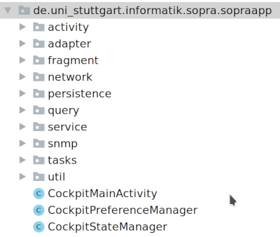

# Komponentendiagramm

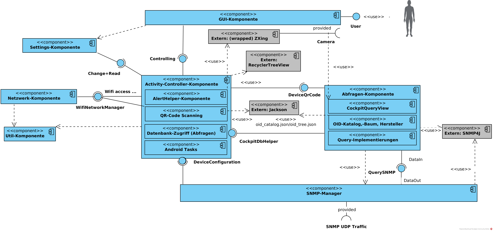

## Activity-/Fragment-Controller-Komponente
* Diese (*Meta*-)Komponente ("Meta" meint: es existiert nicht unbedingt ein eigenes Java Package) beinhaltet alle Android *Activity*- und *Fragment*-Klassen.
* Enthält auch die separierten *Adapter*-Klassen.
* Diese Klassen werden möglichst schlank gehalten und haben lediglich Steuerungs- und Verwaltungsaufgaben, die in anderen Klassen (anderer Komponenten) gekapselt sind.
* Enthält alle Klassen, die "Einstiegspunkte" des Android-Systems für Interaktionen der App sind.
* Jedes Fragment, das nur im Kontext einer SNMP-Verbindung existiert, muss von der Klasse *DeviceFragment* erben.

Packages: *activity*, *fragment*

### Subkomponente: QR-Code-Scanner
* Diese Komponente ist zuständig für das Aufrufen des QR-Code-Scan-Mechanismus und das Verarbeiten der dadurch enthaltenen Informationen.
* Im Kern wird die Bibliothek [ZXing](https://github.com/zxing/zxing) verwendet.
* Wir verwenden die *IntentIntegrator*-Klasse der integrierten ZXing-Bibliothek, um QR-Scans zu initiieren und verarbeiten die Antworten in der *onActivityResult()*-Methode der aufrufenden *Activity*-Klasse.

### Subkomponente: Alert-Helper
* Diese Komponente ist zuständig für das Anzeigen von Dialogen in der gesamten App.
* Der Sicherheits-Lockscreen wird hier konfiguriert.

Klasse: *de.uni_stuttgart.informatik.sopra.sopraapp.activity.AlertHelper*

### Subkomponente: Datenbank-Zugriff
* Diese Komponente besteht im wesentlichen aus der Klasse *CockpitDbHelper* sowie den Konstanten in *DatabaseContract*.
* Model für Eigene Abfragen: id, name, oid, isSingle, tags
* Model für Hardware-Tags: id, name

Package: *persistence*

## Subkomponente: Android-Tasks
* Alle Klassen, die *AsyncTask* erweitern, sind im Package *tasks*.
* JEDE SNMP Abfrage läuft über den *QueryResponseTask*.
* Alle Tasks nutzen App-eigenen Threadpool, s.u. bei SNMP-Komponente.

Package: *tasks*


## GUI-Komponente
* Diese (*Meta-*)Komponente besteht in wesentlichen aus allen layoutrelevanten XML-Dateien sowie Java-Klassen, die konkrete Views auf der Oberfläche abbilden.
* Externe Anzeigebibliotheken für die Daten der App sind noch zu evaluieren.

*Ressourcen und Layout-Files*

## Settings-Komponente
* Diese Komponente beinhaltet die Konfigurationsmöglichkeiten für NutzerInnen der App und den appweiten Zugriff auf diese Einstellungen.

### Einstellungsmöglichkeiten der App
* Eine Klasse: *CockpitPreferenceManager* und *res/xml/pref_general.xml*

*siehe v.a. Screenshots unten*

#### Allgemeine Einstellungen
* **Taschenlampen-Hinweis anzeigen:** Schalter, ob beim Starten eines QR-Code Scans ein Dialog angezeigt werden soll, der darauf hinweist, dass die Taschenlampe mit den Lautstärketasten aktiviert werden kann.
Dieser Dialog lässt sich schließen mit "OK" sowie "Nicht mehr anzeigen".

#### Netzwerk/WIFI-Sicherheit
* **Nur bestimmte WLAN SSID erlauben:** Schalter, um festzulegen, dass diese App nur funktionieren soll, wenn sie sich in einem bestimmten WLAN befindet. Die SSID kann optional manuell festgelegt werden, wird im Standard jedoch aktualisiert beim Scan eines WLAN QR-Codes.
* **Manueller Modus:** Erlaubt das angeben einer bestimmten SSID und aktiviert die nächste Einstellung.
* **Feste WLAN SSID:** Entweder "\[auto\]" oder manuell definiert.

#### Entwickleroptionen
* **Erlaube alle Netze:** Nur zu Entwicklungszwecken und zur Fehlersuche.

## Netzwerk-Komponente
* Diese Komponente beinhaltet alle (WLAN-)Netzwerkfunktionen.
* Diese Komponente kann prüfen, dass man sich in einem *verschlüsselten WLAN* befindet.
* **IPv6:** Bisher keine geeignete Testmöglichkeit vorhanden und der SNMPD in der Uni (und in unseren Testnetzen) funktioniert nicht für IPv6-Verbindungen.
* Die Klasse *NetworkChangeReceiver* lauscht während der Ausführungszeit der App auf Netzwerkveränderungen und meldet den entsprechenden Status in die App zurück.

Package: *network*


## Util-Komponente
* Bietet - überwiegend statisch bereitgestellte - Werkzeuge zur Konversion von IPs, und die Implementierung eines Java *Observables* für einen Boolean-Wert.

Package: *util*


## SNMP Komponente (teilweise extern und verwaltet SNMP4J)
* Diese Komponente ist zuständig für SNMP-Verbindungen und den direkten Zugriff auf die verwendete externe Bibliothek.
* Ein Geräte-QR-Code wird abgebildet durch die Klasse *DeviceQrCode*, die wir mit Jackson auf einen JSON-String mappen.
* Verwaltet SNMP-Abfragen und aktuelle Verbindungen.
* Im Kern wird die Bibliothek [SNMP4J (Apache License v2)](http://www.snmp4j.org/) verwendet.
* Es werden verschiedene Wrapper- und Fassadenmethoden implementiert, um die Funktionen der Bibliothek "nach außen" zu kapseln und Details vor dem Rest der Applikation zu verbergen.
* Jede Verbindung wird definiert durch eine Instanz der Klasse *DeviceConfiguration*.
* Die App nutzt - bis auf eine zeitkritische Ausnahme - immer einen eigenen Threadpool, der im *SNMPManager* verwaltet wird.
* Der *SnmpManager* verwaltet eine v1 Verbindung und eine weitere für v3 Geräte (beides nur, sofern benötigt).
* Der *DeviceManager* verwaltet Objekte der Klasse *ManagedDevice*, die ein Gerät definieren.
* JEDE SNMP Abfrage läuft im Kern über den *QueryTask*.
* Die Versionen SNMP v1/v2c (entweder oder) und v3 (immer) werden unterstützt.
* Es gibt Einzel- und Listen- bzw. Baum-Abfragen (walk).

Package: *snmp*


## Subkomponente: Query-Implementierungs-Komponente
* Stellt eine Klassenstruktur bereit, um SNMP-Abfragen mit Listen und Tabellenabfragen abzubilden.
* Enthält Implementierungen (=Abgeleitete Klassen mit OID-Informationen zu den Spalten) für vordefinierte strukturierte Abfragen, die im Package *query.impl* liegen.
Aktuell hat die App Tabellen der Kategorien *bsd*, *general*, *genua*, *ucdavis*.
* Es gibt Einzel-, Listen-, und Tabellenabfragen.
* Enthält die Klasse *QueryCache*, die fest integriert ist und gewisse (cacheable) Anfragen für 120s vorhält. Manuelle UI-Refreshes (refresh im Options Menü) leeren den Cache für dieses Gerät. Die SystemQuery wird z.B. nie gecached.
* Jede Abfrage ist definiert als Ableitung von *AbstractQueryRequest*


Package: *query*

### Subkomponente: OID-Katalog -Baum, Hersteller-Komponente
* Enthält die Klasse *OIDCatalog*, die alle oben genannten MIB-Einträge permanent vorhält.
* Enthält die Klasse *VendorCatalog*, die alle oben genannten IANA Enterprise Nummern permanent vorhält.
* Stellt einen OID-Baum in der Oberfläche dar mit Hilfe von [RecyclerTreeView](https://github.com/TellH/RecyclerTreeView).
* Lädt die Informationen aus einer externen JSON-Ressource (*oid_catalog.json* bzw. *oid_tree.json*) mit Jackson (s.u.).
* Die Ressourcen-Dateien sollten möglichst austauschbar behandelt werden, auch wenn wir in diesem Projekt nur eine MIB, RFC1213, verwenden.
* Die Ressourcen-Dateien (*./mib*) werden mit eigenen Skripten erzeugt und verwenden im wesentlichen das Tool *mibdump.py* (`pip: pysmi`) und eine eigene *Trie*-Implementierung für den hierarchischen OID-Schlüsselbaum.
* Alle für diesen prinzipiell *einmaligen* Schritt des Erzeugens des Baums + Katalogs notwendigen Infos sind im Ordner *./mib* des Repositories zu finden und zunächst sollte man `converter.sh` ausführen, um MIBs als JSON zu erhalten, und dann werden diese Dateien quasi *gemerged* in die finalen Dateien *oid_catalog.json* und *oid_tree.json*, die dann ins Verzeichnis *res/raw/* zu kopieren sind + Autoformat.
* [Konzept SNMP Abfragen](./Konzept_SNMP_Abfragen.md)


Package: *query*

### Subkomponente: CockpitQueryView
* Ist die Klasse *CockpitQueryView*, die einen *AbstractQueryRequest* oder viele davon anzeigen kann. Wahlweise als Liste oder Tabelle.
* Besteht im Wesentlichen aus einer WebView-Integration, sodass für Abfrageergebnisse HTML/CSS/JS, d.h. Teile des Browserstacks, genutzt werden können.
* Somit ist es möglich, viele Daten effizient und möglichst performant anzuzeigen und dabei (minimale) Nutzerinteraktion zu ermöglichen. Bei JS auf Rückwärtskompatibilität zu ECMA Script Standard **5** achten, da SDK 23 *minSdk* ist.
* Ergebnisse aus SNMP-Abfragen werden zu accordion-style klickbaren HTML Listen gerendert (=ein String erzeugt).
* Jeder angezeigte Tab in der Geräte-Detailansicht ist ein CockpitQueryView mit ein oder mehreren Bereichen (=Abfragen).

## Externe Komponente: Jackson-Databind (com.fasterxml.jackson.core:jackson-databind:2.9.7)
* Wird verwendet, um JSON-Strings und -Dateien zu (de-)serialisieren in Java-Objekte mit speziellen Annotationen.
* Geräte-QR-Code-Klassen im Package *snmp.json*.
* [Github Repository](https://github.com/FasterXML/jackson-databind)
* Apache v2

## Externe Komponente: ZXing Integration, (com.journeyapps:zxing-android-embedded:3.6.0)
* Ist ein Wrapper rund um die verbreitete QR-Code-Scanner Bibliothek ZXing und macht es für Entwickler relativ einfach, QR-Code-Scanner in einer App zu verwenden.
* [Github Repository](https://github.com/journeyapps/zxing-android-embedded)
* Apache v2

## Externe Komponente: RecyclerTreeView (Quellcode in *tellh.com.recyclertreeview_lib*)
* Wird verwendet zur Darstellung eines OID-Baumes in der App.
* Diese Bibliothek besteht aus 4 Klassen und ist nicht im Gradle Build integriert, sondern liegt im *src*-Ordner.
* [Github Repository](https://github.com/TellH/RecyclerTreeView)
* Apache v2
* Die Original-Klassen können modifiziert werden.

## Externe Komponente: SNMP4J (org.snmp4j:snmp4j:2.5.3)
* Wird verwendet, um SNMP-Verbindungen herzustellen, Abfragen auszuführen und die App mit Informationen zu versorgen.
* [Projekt-Webseite](http://www.snmp4j.org/)
* Apache v2


# Activity-/Fragment-Orientiertes Klassendiagramm

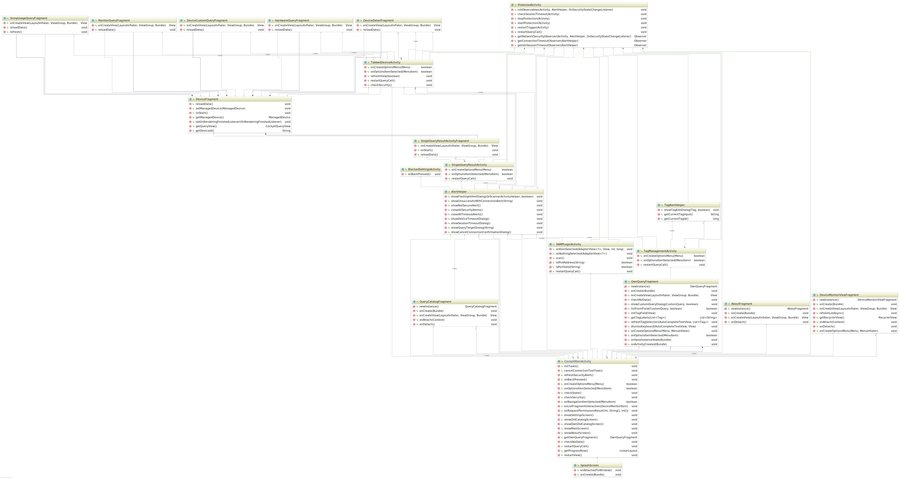   

[Activity- und Fragmentorientiertes Klassendiagramm mit Abhängigkeiten als Vektorgraphik](https://sopra.informatik.uni-stuttgart.de/sopra-ws1819/sopra-team-22/blob/master/doc/diagramme/activity_fragments.svg)

## Beschreibung SplashScreen
* Diese Klasse ist die Launcher-Activity und sie leitet weiter auf die *CockpitMainActivity*. Initiale Tasks der App können hier ausgeführt werden.

## Beschreibung CockpitMainActivity
* Diese Klasse ist die Hauptklasse/Interface, sie ermöglicht die Verwaltung der Abfragen, Geräte und Verbindung der Komponenten. Darüber hinaus, kann sie Infos bezüglich der bestehenden Verbindung ausgeben.
* Sie verwaltet 5 verschiedene Screens. Enum: `CockpitScreens`


## Beschreibung ProtectedActivity
* Das Java-Interface *ProtectedActivity* wird von jeder Activity implementiert, die im sicheren Netzwerk ausgeführt werden darf.
* Der komplette App-Sicherheitsmechanismus auf Activity-Ebene an *einer* Stelle für *alle* Activities.
* Das Interface besteht nur aus *default*-Methoden.

## Beschreibung CockpitStateManager
* Verwaltet 3 boolsche Status-Observables: **Netzwerksicherheit**, **Verbindungs-Timeout**, **Session-Timeout**.
* Verwaltet den Lock für den Zustand *isInRemoval*
* Verwaltet den Lock für den Zustand *isConnecting*
* Hat eine Referenz auf den *QueryCache*.


## Beschreibung CockpitPreferenceManager
* Diese Klasse verwaltet alles, was mit den Einstellungen (*Preferences*) der App zu tun hat. Enthält alle Preference Keys als Konstanten.
* Diese Klasse enthält das *GeneralPreferenceFragment* der App, d.h. die Einstellungen (Menü: Einstellungen) der App.
* Wird verwendet in der BlockedSettingsActivity.
* Wenn sich Einstellungen ändern, muss dies sofortige Auswirkungen auf die komplette App haben, insbesondere beim Ändern der Netzwerksicherheitseinstellungen.

## Beschreibung TabbedDeviceActivity
* Dies ist die **Geräte-Detailansicht** mit 5 oder 6 eigenen Tabs. Eigenen Abfragen werden nur ein einem eigenen Tab angezeigt, wenn auch Abfragen vorhanden sind.

## Beschreibung SingleQueryResultActivity
* Stellt ein *CockpitQueryView* dar als Abfrageergebnis. Die Abfrage kann erneuert werden im Optionsmenü.

## Beschreibung SNMPLoginActivity
* Diese Klasse stellt grundsätzlich eine Anmelde-Fenster für Geräte mit den SNMP Versionen v1 und v3 in der App dar und die Funktionalität, sich mit Geräten zu verbinden sowie einen Geräte QR-Code zu scannen.

## Beschreibung BlockedSettingsActivity
* Diese Klasse dient stellt isoliert das *CockpitPreferenceManager.GeneralPreferenceFragment* dar, um während des blockierten App-Zustands die Netzwerkeinstellungen ändern zu können. Diese können Auswirkungen auf den Sicherheitszustand der App haben.
* Ansonsten wird diese Activity nicht verwendet.

## Beschreibung AlertHelper
* Diese Klasse enthält Hilfsmethoden für Dialoge in der App.

## Beschreibung WifiScannerActivityHelper
* Diese Klasse enthält Hilfsmethoden zum Scannen von QR-Codes (aktuell: WIFI, Soll: auch Geräte), die die App benötigt.
* Vor dem Aufruf einer Scan-Oberfläche wird - je nach Einstellung (s.u.) - ein Dialog angezeigt, der auf die Verwendung der Taschenlampe mit Hilfe der Lautstärke-Tasten hinweist.

## Beschreibung AboutFragment
* Steuert die Darstellung eines Informations-Fragments über die App, z.B. Versionsinfos etc..

## Beschreibung DeviceMonitorViewFragment
* Steuert die Darstellung eines einzelnen verbundenen Gerätes in einer Liste und behandelt alle Aktionen in der Oberfäche.

## Beschreibung QueryCatalogFragment
* Steuert die Darstellung eines OID-Baumes, konkret auf Basis der *oid_tree.json*. Verwaltet und interagiert mit dem RecyclerTreeView auf dem Klassenpfad.
* Es ist noch nicht abschließend geklärt, was genau im Baum passieren soll bei einem Klick oder wo der Baum integriert wird, da er ein Fragment ist und das einfach geht.

## Beschreibung BooleanObservable
* Eine Java *Observable*-Implementierung, um einen binären Zustand zu speichern und Änderungen an die *Observer* auszuliefern.
* Wird im wesentlichen verwendet zum Halten des Zustands, ob die App sicher ist. Wenn sich das Netzwerk ändert (z.B. *NetworkChangeReceiver*, aber auch durch andere Trigger in der *CockpitMainActivity*)

## Beschreibung NetworkChangeReceiver
* Empfängt Netzwerkstatus-Events von Android OS, checkt den Netzwerksicherheitsstatus der App und triggered bei Bedarf den Lockscreen (s.h. *AlertHelper*).

## Beschreibung WifiMetworkManager
* Verwaltet alles mit WIFI und Netzwerk und kennt den Netzwerksicherheitsstatus.
* Versorgt die App mit allen Netzwerkinformationen, die in der Oberfläche dargestellt werden.

## Beschreibung DeviceQrCode
* Java POJO mit *Jackson* Annotations, das der Darstellung des QR Codes des Kunden entspricht. Mit dem Einsatz von Jackson werden wir automatisch agnostisch gegenüber Leerzeichen, Zeilenumbrüchen oder anderen erlaubten Zeichen in JSON-Strings beim Lesen von Geräte-QR-Codes. Faktisch bedeutet das optisch kleinere QR-Codes.

# SNMP-Komponente Klassenstruktur

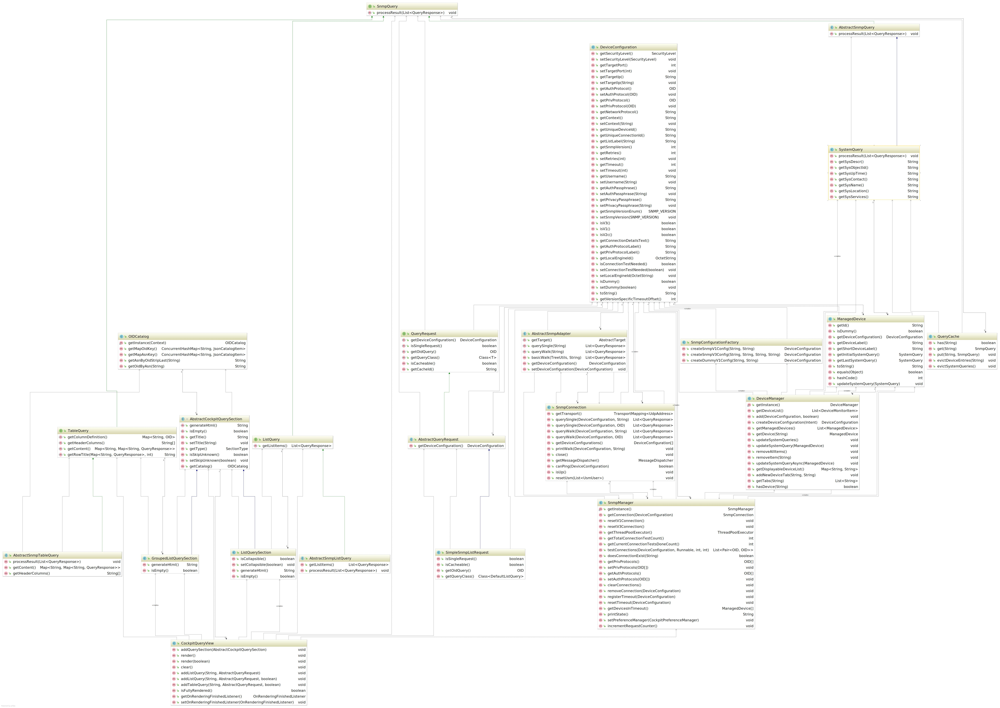  

[Klassenstruktur des SNMP und Query-Packages als Vektorgraphik(sehr groß)](https://sopra.informatik.uni-stuttgart.de/sopra-ws1819/sopra-team-22/blob/master/doc/diagramme/snmp_struktur.svg)

Dieses Diagramm stellt die aktuelle Klassenstruktur der SNMP-Komponente dar.

# Beschreibung

Die zentrale Singleton-Klasse **SnmpManager** ist der Dreh- und Angelpunkt des SNMP-Zugriffs der App.

# GUI

Wir verwenden normalerweise Icons aus den Material Design Libraries, aber teilweise (Hinweise in der Readme beachten) verwenden wir externe Icons.

Die App soll möglichst vollständig den Material Design Guidelines folgen und soll eine selbstklärende Oberfläche besitzen.

### Start- und Hauptansicht (hier mit Netzwerk-Dialog)

* Die Hauptansicht soll grundsätzlich nur in Ausnahmefällen durch den/die NutzerIn verlassen werden
* Über das Aufklappmenü oben links (= Sidebar, nächster Screenshot) erreicht man alle wichtigsten Funktionen der App
* Über das Optionsmenü oben rechts erreicht man weitere Funktionen der App
* Der Floating Action Button unten links ist zum Hinzufügen weitere Geräte zur App, wenn erlaubt

##### Verbindungsversuch in der Hauptansicht
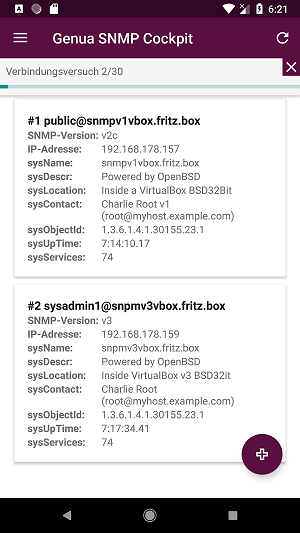
##### Fertiger Verbindungsversuch
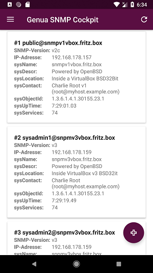

### Geräte-Menü
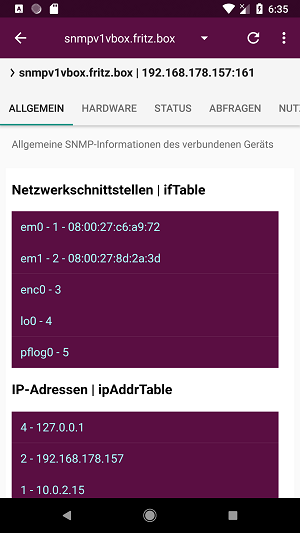
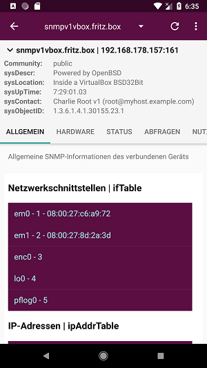
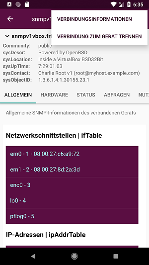
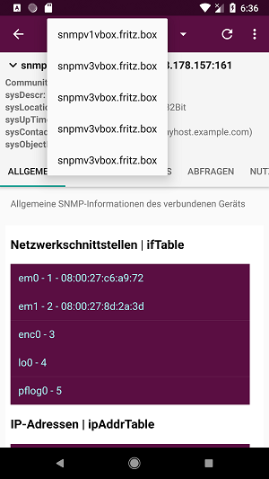
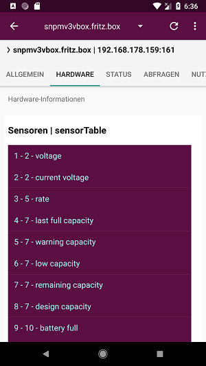
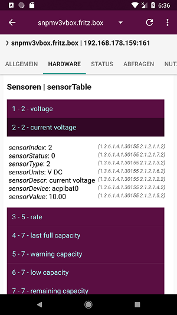
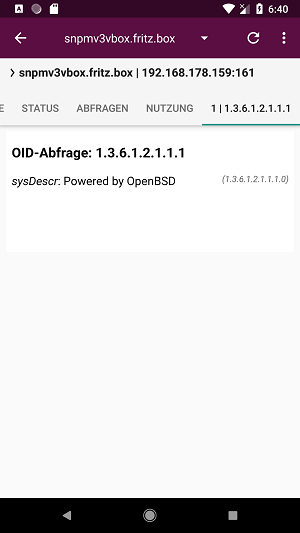

### Geräte Verbindung unterbrochen
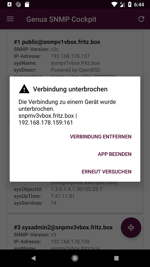

### Session Timeout
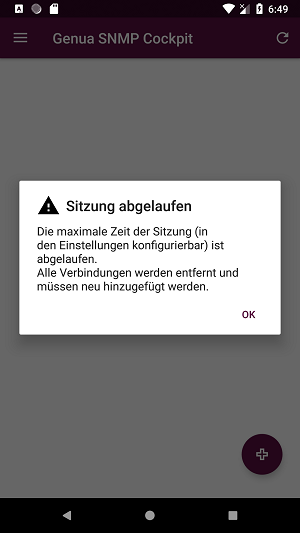

### Verbindungsinformationen
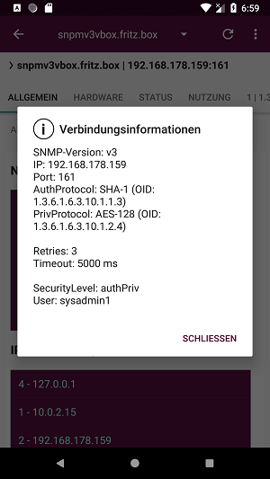


### Sidebar-Menü

* **Hinweis:** Menü und Benutzerführung noch nicht abschließend konzeptioniert.
* Die Sidebar zeigt die wichtigsten Netzwerk-Parameter an.
* Die Ansicht zeigt die Startansicht. Diese soll, falls noch keine Internetverbindung (wie beim Start der App) besteht, eine Meldung ausgeben und der User soll die Möglichkeit haben sich manuell oder via QR-Code zu verbinden.
* Die **Sidebar** listet die wichtigsten Schnellzugriffselemente. Diese können mit der Zeit geändert werden, bzw. neue Elemente können hinzugefügt werden.
* Die Siderbar zeigt die Anzahl der verbundenen Geräte an

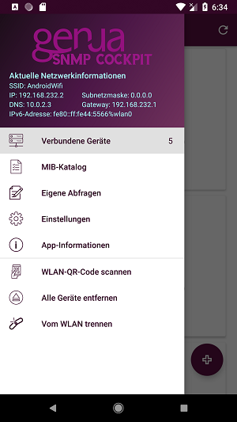

### Einstellungen


### Lockscreen

* Es gibt diese Optionen für den Benutzer:
- Wenn kein WLAN aktiviert ist, kann es per Knopfdruck auf der App heraus aktiviert werden.
- Die App kann beendet werden
- Das Einstellungsmenü (*BlockedSettingsActivity*) kann geöffnet werden
- Ein neuer WIFI-QR-Code kann gescannt werden

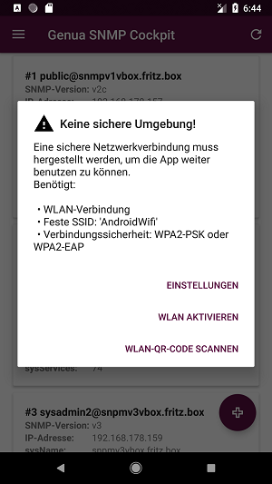

### SNMP v1/v2c Verbindung starten

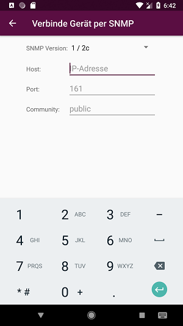

### SNMP v3 Verbindung starten
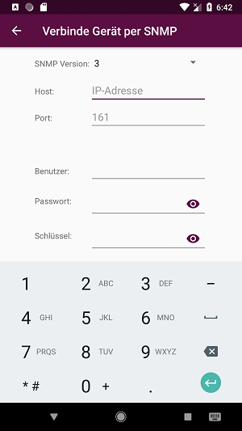

### OID-Baum RFC1213
- Noch nicht abschließend geklärt, was wir damit in der App machen.

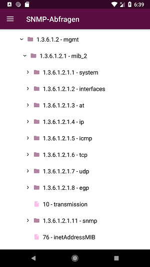

### SMNP-Abfragen an Geräte senden
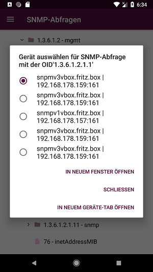

### OID-Abfrage
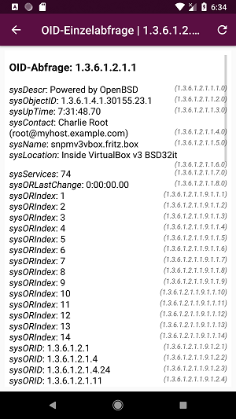


### GUI-Skizzen, die bei der Umsetzung wichtig waren

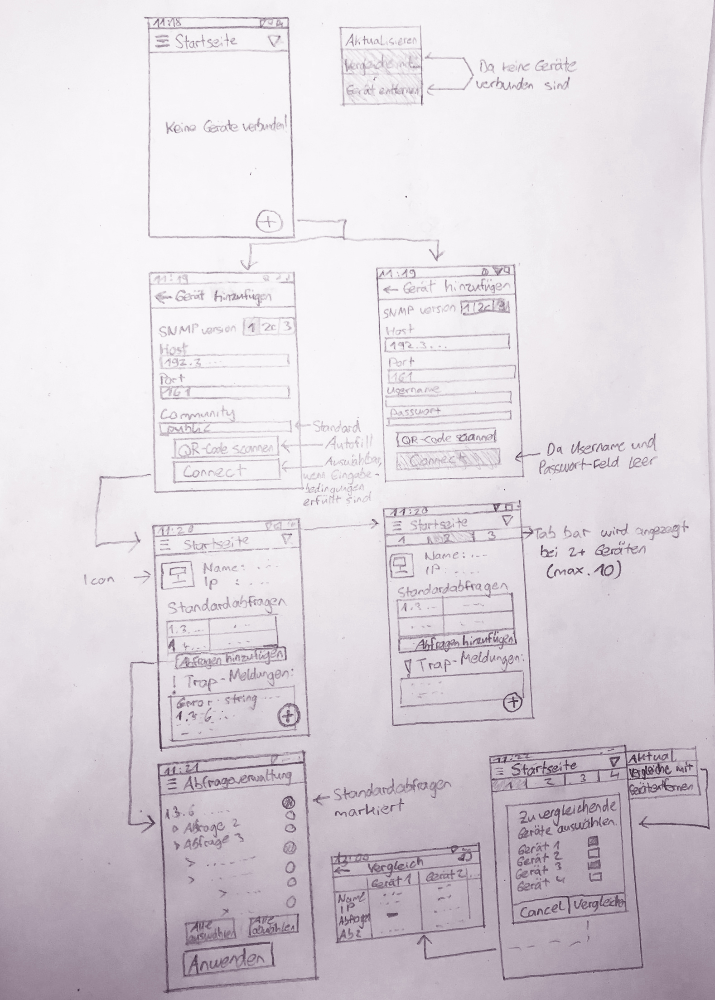


light: FCBFE9

dark: B085A2