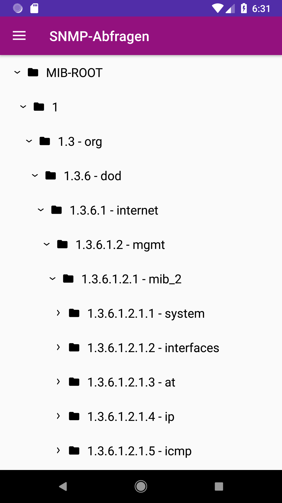

# Konzept SNMP Abfragen
*Stand: 21.11.2018*

Dieses ist das aktuelle Konzept zur Diskussion für die Modellierung und Integration der OID-Abfragen in die App.

## Ist-Stand:
* Ein maschinenlesbarer OID-Baum und -Katalog liegt vor im *.json*-Format.
* Der Baum wird prototypisch in der App dargestellt.

## Soll (also noch offen):
* Die Grundlage aller OID-Operationen ist der OID-Katalog. Er wird außerhalb von der App erstellt und als Artefakt in den Ressourcen-Ordner *raw* gelegt.
* SNMP-Abfragen sind in die App technisch (und optisch!) integriert.
* *AndroidRecyclerTreeView* ist noch nicht genehmigt.

# Allgemein
Alle Dateien und Skripte dieses Konzepte liegen im Projektverzeichnis im Ordner *mib*.

Wir benutzen das python Tool `mibdump.py` aus dem Package `pysmi` im Bash-Skript *<project-root>/mib/converter.sh*, um alle für uns relevanten MIBs herunterzuladen als
**.mib*-files in den gleichen Ordner und um daraus direkt **.json*-Repräsentationen zu erstellen.

Das Kommando `python3 converter.py` schließlich sorgt für folgendes:

Die relevanten **.json*-Dateien im *mib*-Ordner werden eingelesen und in der Datei `oid_catalog.json` in einer Liste zusammengefasst, Schlüssel sind die OIDs.
Zusätzlich wird ein hierarchischer Baum erstellt, der weniger Informationen enthält `oid_tree.json`.

# OID-Katalog
Repräsentiert durch die Datei `oid_catalog.json`.

# OID-Tree
Repräsentiert durch die Datei `oid_tree.json`.

Prototypische Integration in der App:

# SNMP(-Testsysteme)
Bitte VM-Installations- und Debug-Hinweise für `snmpwalk` beachten [hier](./snmp_debugging.md).

Es wird ein Raspberry Pi Testsystem eingerichtet mit mindestens drei SNMP-Daemons, je für v1, v2c und v3.
Die Dokumentation der Testsysteme erfolgt in diesem Dokument.

# Offene Punkte/Fragen (an alle!)
* Wie integrieren wir die Geräte? Wie sieht das aus und welche Rolle spielt der oben dargestellte Katalog?
* Was passiert bei einem Klick auf ein Blatt- oder Ordner-Element im Baum?
* Was, wenn der *RecyclerTreeView* (=der Baum im Screenshot) nicht genehmigt wird?